# Configuring Intel AMT

*December 13, 2023*

In the realm of remote computer management, Intel's Active Management Technology (AMT) stands out as a powerful, built-in tool that allows IT professionals to monitor, maintain, update, and troubleshoot devices, irrespective of the device's power state or operating system condition. This article aims to show how I configured Intel AMT on my Proxmox hosts (HP EliteDesk 800 Mini).

Implementing Intel AMT within a homelab context is like having a remote control for your entire lab. It affords users the luxury of managing and troubleshooting devices from anywhere, regardless of whether the machine is powered on or if its OS has crashed. This capability not only streamlines the management of multiple devices but also drastically reduces downtime and accelerates iterative experimentation. Imagine performing BIOS updates, booting from remote images, or diagnosing hardware issues, all from the comfort of your desk or even another city. 

## Why AMT?
The beauty of Intel AMT is that it is embedded within the chipset of Intel-vPro-enabled processors. This ensures a direct interaction with the core components of a computer, including its memory, storage, and networking. Unlike traditional remote management solutions that necessitate additional hardware dongles or KVM switches to transmit input and display data across systems, Intel AMT operates at a layer beneath the operating system and primary software.

What this means in practical terms is twofold:

- Uninterrupted Access: Even if the operating system crashes or the system is powered off, AMT still provides remote access to the computer. This is because its functionality is decoupled from the primary OS's operational state.

- No External Hardware: With Intel AMT, there's no need to invest in and manage additional hardware. There's no clutter of KVM switches, no external dongles, and no additional power or networking cables. It’s a cleaner and more integrated solution, ensuring you can remotely control, reboot, or even re-image a machine seamlessly.

Intel AMT offers the capabilities of external KVM solutions but without the associated hardware overhead. This deep integration ensures a more streamlined, efficient, and cost-effective remote management experience.

## Security Implications
Of course, there are some security concerns with having a management interface that provides full KVM level access to a computer accessible from the network.  To provide some mitigation of this, I have set strong passwords and configured the untagged VLAN to be on a dedicated management network with restricted access at the firewall level.

## How to Setup Intel AMT
In this guide, I use an HP EliteDesk 800 G3 Mini as an example system.  The BIOS entry and settings will appear differently on different systems, but the configuration of AMT should be similar.

### Enter the Setup Menu
At the startup screen, press `esc` to enter the boot menu

### Enter Management Engine Setup
Select the option for `ME Setup`
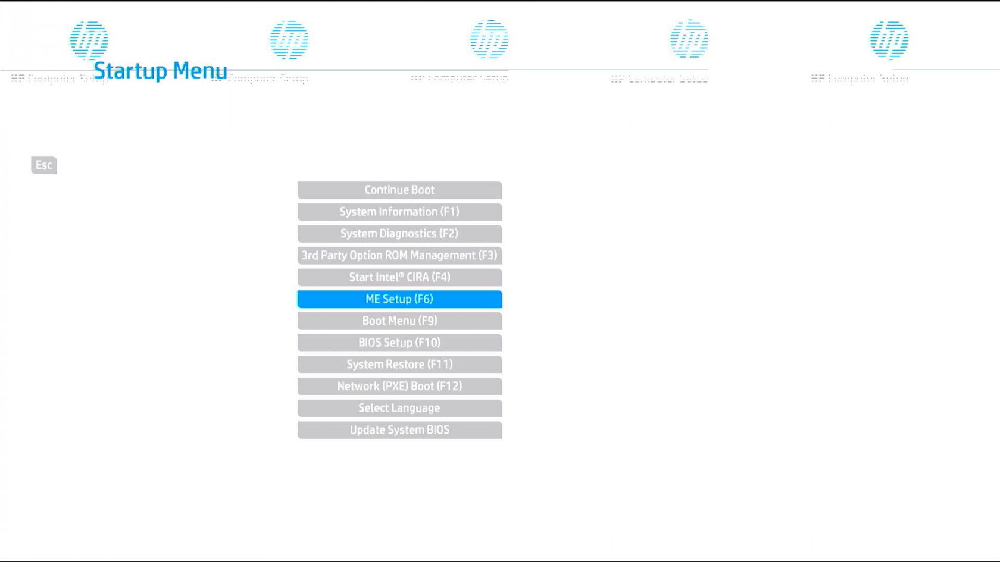

### Login to MEBx
Once in the ME Setup area, select the first option for `MEBx Login`
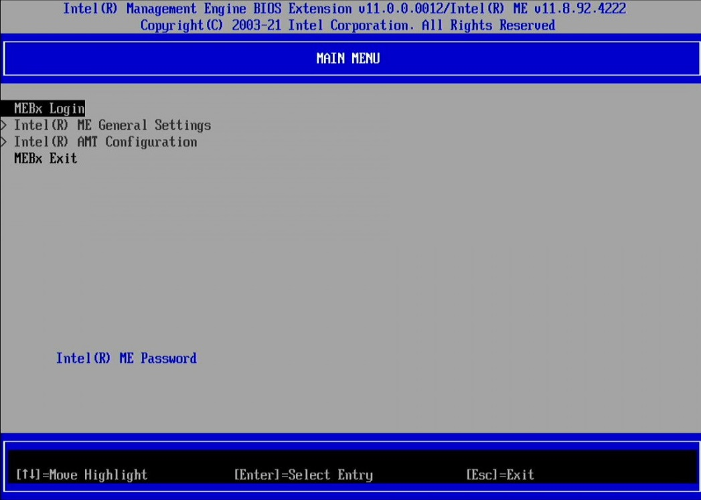

### Setup the Management Password
Enter the password to use for the management engine when prompted, then type it again to verify when prompted.
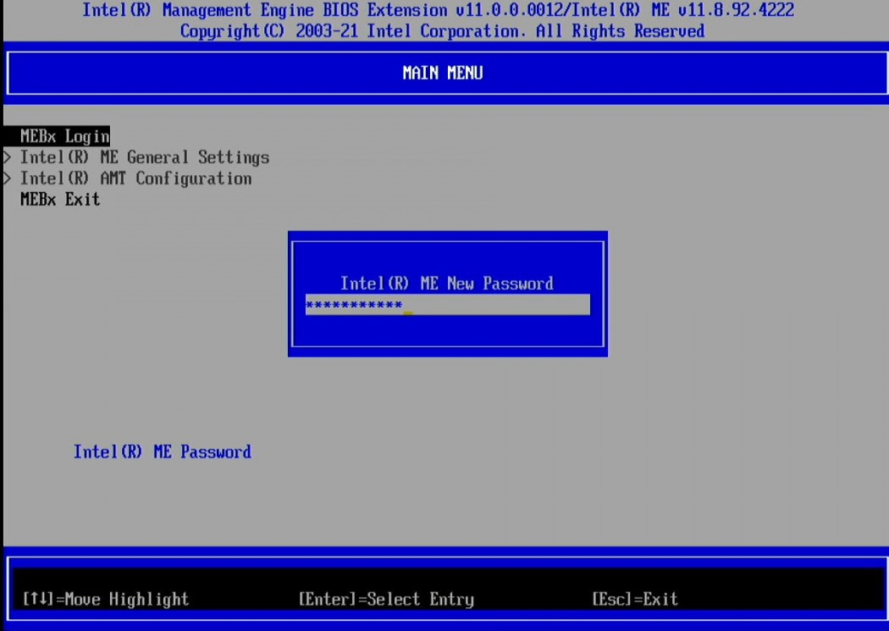

### Configure AMT Settings
Enter the `Intel (R) AMT Configuration`

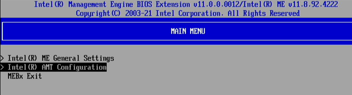

Select `SOL/Storage Redirection/KVM`

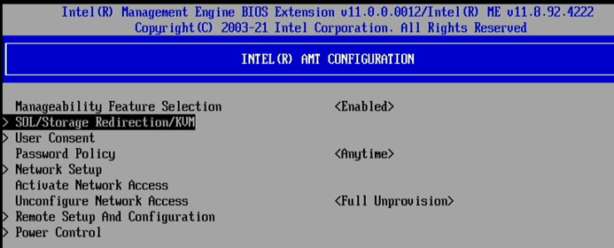

Enable all of the options and hit `esc` to back out to the Intel (R) AMT Configuration menu

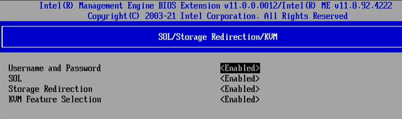

Choose `User Consent` from the AMT Configuration menu

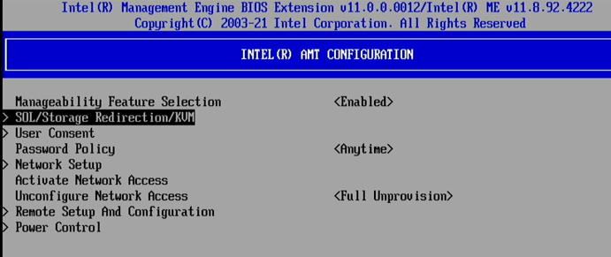

Set User Opt-in to `NONE` and Opt-in Configurable from Remote IT to `Enabled` 

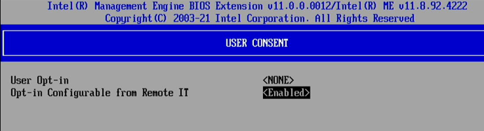

Press esc to return to the AMT Configuration Menu and choose `Network Setup`

From the Network Setup menu, select Network Name Settings

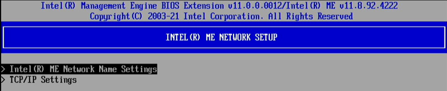

Fill in the Host Name and Domain Name.  I used `pve02` as my host name

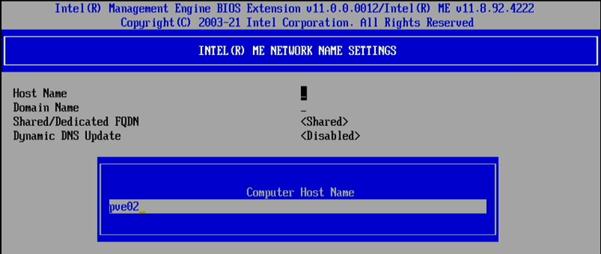

Return to the Network Setup Menu and go to TCP/IP Settings

In the TCP/IP Settings menu, select Wire LAN IPV4 Configuration

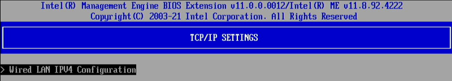

I plan to use a static IP address, so I set DHCP Mode to `Disabled` which makes the IP settings visible

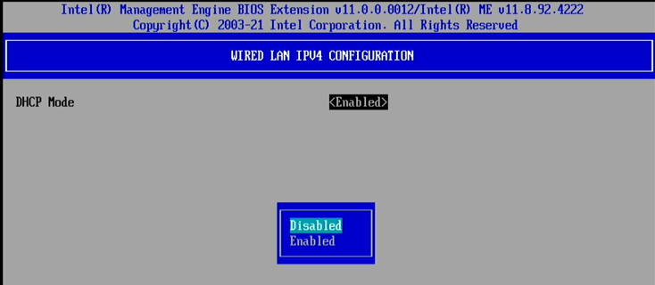

Fill in the IP Address, subnet mask, and default gateway for your network.  I did not fill in DNS settings.

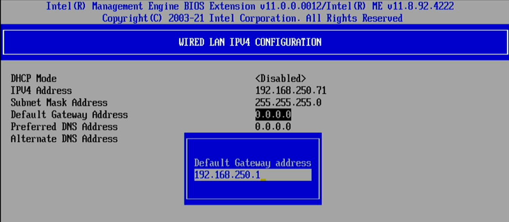

Return to the AMT Configuration menu and select Activate Network Access.  Press `Y` when prompted to proceed

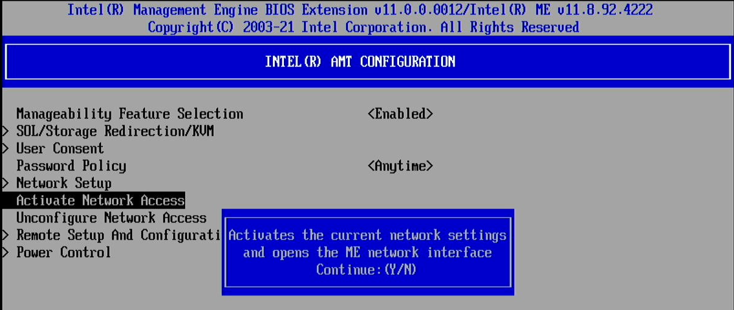

At this point, you can exit and reboot.  AMT should be enabled at this point.

## Accessing AMT

Intel's Manageability Commander can be used to access the KVM functions from a Windows machine.  It can be obtained from Intel [here](https://www.intel.com/content/www/us/en/download/18796/intel-manageability-commander.html).

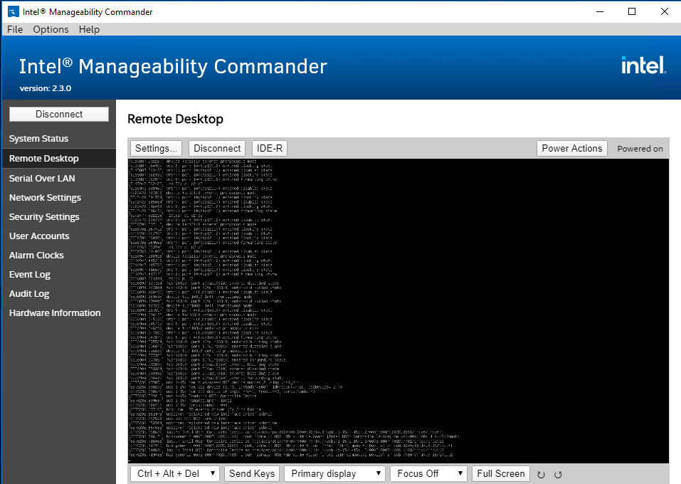
(note: you can read the screen when you properly size the window)

In order for the KVM to show the video output, the machine must have a monitor attached.  To get around this requirement, I used DisplayPort monitor emulated dongles from Amazon.  I didn't do a lot of research into the different brands that are out there, but I'm using [this](https://www.amazon.com/gp/product/B0BTP1GBL5) one and it has worked.