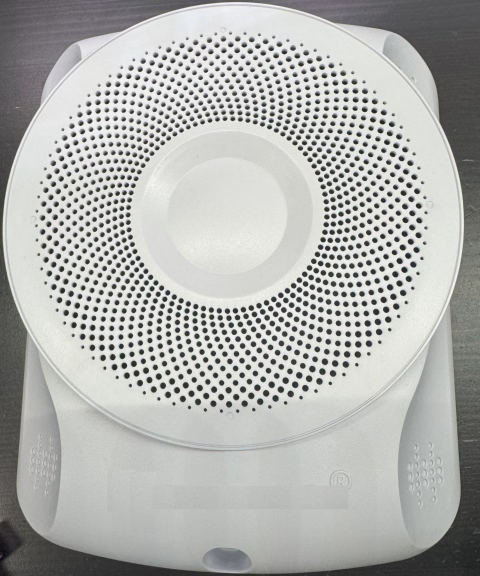
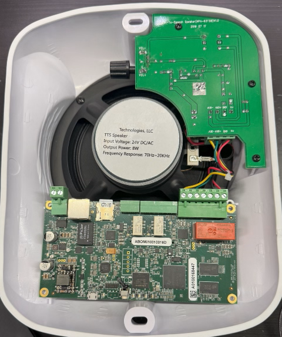
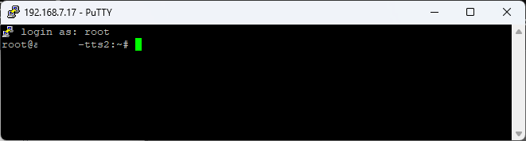

# Repurposing a Commercial Mass Notification Device for Custom Use

*April 29, 2025*

> *This analysis is intended for educational and research purposes only. No proprietary software is included or redistributed, and vendor names or customer-identifying details have been redacted out of respect for the critical role these devices serve. The focus here is on responsibly repurposing e-waste into something useful—not calling out vulnerabilities. The views expressed are my own.*

I’ve been working on a Raspberry Pi Zero–based intercom system for a while now. It’s designed for playing synchronized audio announcements across zones — things like alarm system notifications, home automation events (“dryer done,” etc.), and real-time voice announcements from our phone system. Essentially, it’s a mass notification system for the house.

I stumbled across a device on eBay that seemed like it might be a good fit: a device used in commercial, academic, or government emergency mass notification systems. From the photos alone, I spotted a Texas Instruments AM437x chip, PoE support, onboard amplifier, SD card slot, and speaker wiring — all signs that it was likely running Linux and could be repurposed. I made an offer and ended up with a few units.

This post is a walk-through of what I did to explore the hardware, understand its software, and ultimately bring it back to life running a clean Linux image. My goal was to get the device back to a standard Linux install to make it usable for my own projects.

## Background on Mass Notification Systems

Mass notification systems are critical tools for delivering urgent information quickly and reliably across a wide audience. In educational settings like K–12 schools and universities, they are used to alert students and staff to emergencies such as active shooter situations, severe weather, or fires. In government and industrial environments, they may signal chemical spills, hazardous material incidents, or facility lockdowns. Regardless of the setting, the goal is the same: to ensure that people receive critical instructions within seconds, helping to protect lives during fast-moving or dangerous situations.

## Hardware Overview

The device came in a professional-looking, wall-mountable enclosure, clearly designed for institutional use. Here’s what I found from both visual inspection and inspection of the included SD card:

- **Processor:** TI AM437x (ARM Cortex-A9)
- **Storage:** microSD card and eMMC
- **Networking:** Ethernet with PoE support
- **Audio Output:** Onboard amplifier connected to a large speaker
- **Indicators:** Multiple status LEDs wired to GPIOs
- **Relays:** GPIO-controlled relays
- **OS:** Arago Linux (TI’s Yocto-based distro), running from SD (not the flash chip on the board)

This setup was compelling because it had everything I’d been piecing together with Raspberry Pi Zeros, but in a single, purpose-built unit.

|  |  |
| ------------------------------------------------ | ---------------------------------------------- |

*Left: Front of the speaker enclosure. Right: Internal boards mounted on the rear panel (processing board at bottom center, amplifier at top right).*


## Device Imaging and Offline Analysis

Before diving in, I captured a full image of the SD card using Win32DiskImager, just in case I needed to revisit the original data later, or if I broke something during live exploration. I then mounted it in a Linux VM for offline analysis. The card had two partitions: a `boot` partition with U-Boot and config files, and a `rootfs` containing the full Linux filesystem. I began inspecting startup scripts, installed binaries, and key configuration directories like `/etc/init.d` and `/etc/systemd`, as well as user-space folders like `/home/root`, which contained most of the vendor’s proprietary tooling—a somewhat atypical place for embedded applications to live. In the root user’s home directory, I also reviewed `.bash_history` and `.python_history`—neither had been wiped, but they didn’t contain anything especially useful.

```bash
root@[REDACTED]-tts2:~# cat .bash_history
cd /home/root/ttsp2/bin
./ttsapp p2 p1
ps aux > tat -tulnp
reboot
df -h
mount
```

While digging through `/home/root`, I came across a stray file named `tat -tulnp` — ...likely a typo of `netstat -tulnp`, typed directly into the shell and accidentally redirected to disk. Despite the mistake, it contained a preserved snapshot of running processes (likely created by writing the output of `ps aux` from the `ps aux > tat -tulnp` line in `.bash_history`), offering an unexpected glimpse into the system’s active services and launch behavior.

```bash
USER       PID %CPU %MEM    VSZ   RSS TTY      STAT START   TIME COMMAND
root         1  0.0  0.5  24548  5504 ?        Ss   17:23   0:05 /sbin/init
...
avahi      484  0.0  0.1   4224  1464 ?        S    17:23   0:00 avahi-daemon: chroot helper
root       508  0.0  0.1  20196  1884 ?        Sl   17:23   0:02 /usr/local/rsyslog/sbin/rsyslogd -c5
root       634  0.0  0.5   8648  5676 ?        Ss   17:23   0:07 /usr/sbin/snmpd -Ls0-6d -a -f
pulse      658  0.0  2.2 110792 22616 ?        S<sl 17:23   0:01 /usr/bin/pulseaudio --system --disallow-exit --disable-shm
...
root      1117  0.0  0.1   2656  1664 ?        Ss   17:24   0:00 /usr/sbin/dropbear -i -r /etc/dropbear/dropbear_rsa_host_key -B
```

This snapshot confirmed the presence of several well-known services and tools:

* Syslog: Logging of events on the device
* SNMP:  Health/status monitoring
* PulseAudio: Audio subsystem used for audio playback
* Dropbear:  SSH server
* Stunnel: Secure tunneling application
* Redis:  An in-memory data store

More interesting to me was a glimpse into how the software on the device ran. The `init` script `/etc/init.d/startTTS.sh` revealed how the vendor software launched.

```bash
root       804  0.0  0.1   2900  1984 ?        Ss   17:23   0:00 /bin/sh /etc/init.d/startTTS.sh
root       805  0.1  2.8 338388 29620 ?        Sl   17:23   0:16 /home/root/ttsp2/bin/ttsapp p2 p1
```

I also found OpenSSL commands that pointed to the original deployment environment — suggesting the device hadn’t been fully sanitized before being resold:

```bash
root      2314  0.0  0.1   2908  1948 ?        S    20:02   0:00 sh -c openssl s_client -showcerts -verify 5 -connect [URL REDACTED]:8443 < /dev/null | awk '/BEGIN/,/END/{ if(/BEGIN/){a++};out="/tmp/tts/cert/cert"a".pem"; print >out}' 2>&1
root      2315  0.0  0.3   4208  3192 ?        S    20:02   0:00 openssl s_client -showcerts -verify 5 -connect [URL REDACTED]:8443
root      2316  0.0  0.1   2900  1592 ?        S    20:02   0:00 awk /BEGIN/,/END/{ if(/BEGIN/){a++};out="/tmp/tts/cert/cert"a".pem"; print >out}
```

This gave me some great insights into how the device operated and some ideas as to where to look next.

I then ran `strings` on their main executable to look for hints about how the system functioned. This revealed everything from audio pipeline configuration and internal error strings to developer usernames and build paths like:

```bash
/home/[REDACTED]/Work/Projects/ti/CCS/workspace_v8/ProductionBoard/[REDACTED]/
```

This kind of path is typical of Code Composer Studio (CCS) projects and aligned with the TI SDK stack suggested by the hardware. From the developer usernames and build artifacts, it was possible to infer that a distributed development model was likely used, with specialists focused on areas like audio processing, SIP integration, and embedded system security. While anonymized here, these artifacts offered an additional glimpse into the technical domains prioritized during the device’s original design and firmware development.

While reviewing `boot/userdata/configs/ttsconfigs.json`, I also found a cleartext configuration file specifying how the unit was expected to connect to its management infrastructure. Here's an excerpt:

```json
{
  "name": "[REDACTED] NM PRODSERVER",
  "server": "[REDACTED].[REDACTED]",
  "OrgId": [REDACTED],
  "port": 80,
  "tlsport": 8443,
  "tls": "on",
...
  "syslog": {
    "enabled": "off",
    "destination": "remote",
    "server": "[REDACTED]",
    "port": 514,
    "level": 127
  }
}
```

This configuration aligns with earlier evidence of `s_client` processes found in the process list. It confirms that the device was designed to securely connect to a central management endpoint. The presence of a named organization and endpoint URL also reinforces that this device was fielded (or prepared for fielding) and not factory-reset before resale.

I also examined the audio files stored on the device. While most were standard chimes, tones, and sirens used in emergency notification systems, a few stood out, particularly `ilovescotch.wav`, `loudnoises.wav`, and `stayclassy.wav`.

```bash
root@[REDACTED]-tts2:~# ls AlertWAVs/ -l
-rw-r--r--    1 root     root         91896 Oct 30 13:30 ilovescotch.wav
-rw-r--r--    1 root     root         23018 Oct 30 13:30 loudnoises.wav
-rw-r--r--    1 root     root         34380 Oct 30 13:30 stayclassy.wav
...
-rw-r--r--    1 root     root        492376 Oct 30 13:30 Siren_Wail.wav
-rw-r--r--    1 root     root        352878 Oct 30 13:30 Emergency_Tone_2.wav
-rw-r--r--    1 root     root       1039142 Oct 30 13:30 Tone7_Urgent.wav
```

These were mixed in with many other tones in `AlertWAVs/`. It’s not clear whether the humorous files were ever used in production, but their presence suggests that someone on the development team liked the movie *Anchorman*.

Finally, examining `/etc/passwd` and `/etc/shadow`, I found the `root` user had no password set. Combined with Dropbear SSH running by default, this was a strong indicator that I could gain access over the network — which led naturally into the live exploration phase.


## Live Analysis

With everything I’d seen during offline analysis, it was time to power up the unit and interact with it live. I connected it to a segregated VLAN and watched for DHCP activity — the device pulled an address immediately. Using PuTTY, I attempted to connect via SSH. It worked on the first try. I just typed `root` at the username prompt, no password. I was in, *as root* — just as expected from my earlier review of `/etc/passwd` and `/etc/shadow`.



### Active Processes

Once in, I began reviewing the state of the system:

```bash
root@[REDACTED]-tts2:~# ps aux
USER       PID %CPU %MEM    VSZ   RSS TTY      STAT START   TIME COMMAND
root         1  0.0  0.5  24548  5504 ?        Ss   17:23   0:05 /sbin/init
...
root       805  0.1  2.8 338388 29620 ?        Sl   17:23   0:16 /home/root/ttsp2/bin/ttsapp p2 p1
root      1117  0.0  0.1   2656  1664 ?        Ss   17:24   0:00 /usr/sbin/dropbear -i -r /etc/dropbear/dropbear_rsa_host_key -B
```

This matched what I’d seen offline: a collection of standard services, plus the vendor’s `ttsapp` binary running from `/home/root/ttsp2/bin/`.

```bash
root@[REDACTED]-tts2:~# uname -a
Linux [REDACTED]-tts2 4.9.69-g10ebf1e4f4 #1 SMP PREEMPT Fri Dec 14 15:29:44 EST 2018 armv7l GNU/Linux
```

This confirmed a TI Arago Linux image from late 2018.

### eMMC Check

To see if the eMMC was used, I dumped the first few blocks of `/dev/mmcblk1`:

```bash
root@[REDACTED]-tts2:~# hexdump -C -n 64 /dev/mmcblk1
00000000  ff ff ff ff ff ff ff ff  ff ff ff ff ff ff ff ff  |................|
*
00000040
```

The repeating `0xFF` pattern suggested that the beginning of the chip, and likely the entire user-accessible region, was unused or erased. A full dump would be needed to definitively determine that though. 

### Audio Output (Initial)

I attempted to play the default audio test file:

```bash
root@[REDACTED]-tts2:~# aplay /usr/share/sounds/alsa/Front_Center.wav
Playing WAVE '/usr/share/sounds/alsa/Front_Center.wav' : Signed 16 bit Little Endian, Rate 48000 Hz, Mono
```

The command ran without error, but there was no sound. I suspected the amplifier path might be disabled — a hunch that would pay off later.

### GPIO and Relay Analysis

To identify relay control pins, I tested candidate GPIOs by exporting and toggling them one at a time while watching (and listening) for changes. Here's an example that triggered relay 114:

```bash
root@[REDACTED]-tts2:~# echo 114 > /sys/class/gpio/export
root@[REDACTED]-tts2:~# echo out > /sys/class/gpio/gpio114/direction
root@[REDACTED]-tts2:~# echo 1 > /sys/class/gpio/gpio114/value
root@[REDACTED]-tts2:~# echo 0 > /sys/class/gpio/gpio114/value
```

Through this process, I confirmed the following:

| GPIO | Function        | Notes                                     |
| ---- | --------------- | ----------------------------------------- |
| 114  | Relay - Small 1 | Control for auxiliary devices             |
| 115  | Relay - Small 2 | Control for auxiliary devices             |
| 117  | Relay - Speaker | Controls audio line-out path to amplifier |

When toggling GPIO 117, I heard a faint pop from the speaker — suggesting it controlled the amplifier’s line connection. After engaging the relay, I re-ran the `aplay` command, and audio played clearly. It appears the amplifier path is deliberately gated, possibly to suppress idle noise.

### LED Label Mapping

I also explored the available LEDs exposed in `/sys/class/leds`:

```bash
root@[REDACTED]-tts2:~# ls -l /sys/class/leds
...
blue:appgood
blue:ipgood
green:dnsgood
yellow:heartbeat
```

These labels pointed to symbolic platform indicators. While the underlying GPIOs weren't directly mapped, their names clearly indicated function:

| Label            | Description         |
| ---------------- | ------------------- |
| blue:ipgood      | Network up          |
| green:dnsgood    | DNS resolution OK   |
| blue:appgood     | Application running |
| yellow:heartbeat | System heartbeat    |

I verified they could be toggled via:

```bash
root@[REDACTED]-tts2:~# echo 0 > /sys/class/leds/green:dnsgood/brightness
```

The green LED briefly turned off, confirming that it and the other listed LEDs were software-controllable.

### Live Analysis Summary

- Network: Pulled IP via DHCP on boot
- SSH: Open access with root/no password (via Dropbear)
- OS: TI Arago Linux (2018), kernel 4.9, ARMv7
- Startup Behavior: `ttsapp` running, typical daemons confirmed
- Audio: Silent until GPIO 117 relay engaged
- eMMC: Present but likely unused (empty header)
- LEDs: Descriptive sysfs links mapped to status indicators
- Security Posture: No root password, no secure boot, open access


## Getting to a Clean Slate

Now that I had a working understanding of the device’s GPIOs, audio path, and overall behavior, I was ready to get it running a clean OS install, free of vendor artifacts, so I could begin adapting it for my intercom project.

I downloaded a Texas Instruments reference Linux image: `am437x-evm-linux-05.02.00.10.img.xz` and wrote it to an SD card using Rufus. The image appeared valid and bootable, but the board wouldn’t bring up its Ethernet interface after boot.

I suspected a missing device driver might be the issue. Back on the vendor SD card, I remembered seeing this in `uEnv.txt`:

```bash
fdtfile=[REDACTED]-tts2-rev8.dtb
```

Sure enough, that file was in `/rootfs/boot` on the vendor card. I copied it to the new image’s `rootfs`. This was a device tree blob (DTB) that described the hardware layout and included configuration data needed for proper driver initialization.

But even with the right DTB in place, it still wasn’t booting.

So, I tried something more drastic: I copied the *entire boot partition* from the vendor card to the new TI image’s SD card, keeping the `rootfs` from the TI image intact.

That worked.

Ethernet came up, I could log in, and the system was now running TI’s Yocto Linux—without any of the vendor’s application binaries. Just a clean, supported OS with the correct device tree and boot configuration. Perfect for repurposing the device as a dedicated intercom endpoint.

From there, I tested GPIO control and audio playback. Thankfully, both worked out of the box using the base TI Yocto Linux image—no vendor binaries needed.

Looking ahead, I plan to create a new device tree for this board using Texas Instruments’ Code Composer Studio and SDK tools. While reusing the original device tree and bootloader was a practical way to validate hardware function, my goal is to eventually build and maintain a clean, fully open configuration — without relying on any vendor-supplied artifacts.

This was exactly where I wanted to end up: a clean slate and full control over the hardware.


## Cybersecurity Notes

While this device was originally intended for use in environments where reliability is critical, its as-received security posture fell short of modern expectations. Key observations included:

- **Root login** enabled with no password
- **Open SSH access** with unrestricted root login
- **Unencrypted filesystem** with no observed secure boot or verified boot mechanisms
- **Embedded strings and build artifacts** (e.g., developer usernames, internal paths) present within binaries without obfuscation

In addition to the technical security gaps noted above, residual configuration data was also found on the device, suggesting that standard practices for decommissioning and sanitization were not followed before resale — particularly significant given the location it had been configured to operate in.

Several plausible explanations could account for the state of the unit. It's possible the device was staged for deployment but never fully commissioned and hardened. Alternatively, it might have relied on strict network segmentation and access controls rather than full system-level hardening—a mitigation approach that falls short of a true defense-in-depth strategy.

> *Note: The device evaluated in this post was obtained secondhand and was not connected to any centralized management or update infrastructure. It’s entirely possible that newer firmware versions or production deployments include additional security measures not present on this unit. This analysis reflects only the state of the device as received and examined in isolation for research purposes.*

## Conclusion

What started as a speculative eBay find turned into a fully functioning, Linux-powered intercom endpoint—without needing to modify or depend on any of the original vendor software. By carefully imaging and analyzing the device, exploring its GPIOs and audio systems, and restoring it with a clean Linux operating system, I was able to repurpose professional-grade hardware into something that integrates with my home automation goals.

This project reinforced the value of careful system analysis and patient exploration — lessons that continue to shape how I approach both hobby and professional technical work.

Along the way, I gained insight into how the original system operated in the field, how it was configured, and where it fell short of modern security expectations. It also served as a reminder of just how much useful information can remain on decommissioned equipment—and how much potential this kind of hardware still has when given a second life.

This process combined hardware exploration, system forensics, and a bit of patience—ending in a result that’s both functional and a great foundation for the next phase of the project.

## What’s Next

In a future post, I’ll shift focus and walk through the broader intercom system I’ve been building—how it works, why I designed it the way I did, and how devices like this one (alongside Raspberry Pi Zeros and other components) fit into a distributed, zone-based announcement platform. This will include an overview of the control server, the playback clients, how announcements are triggered and synchronized, and the system’s current capabilities and limitations.