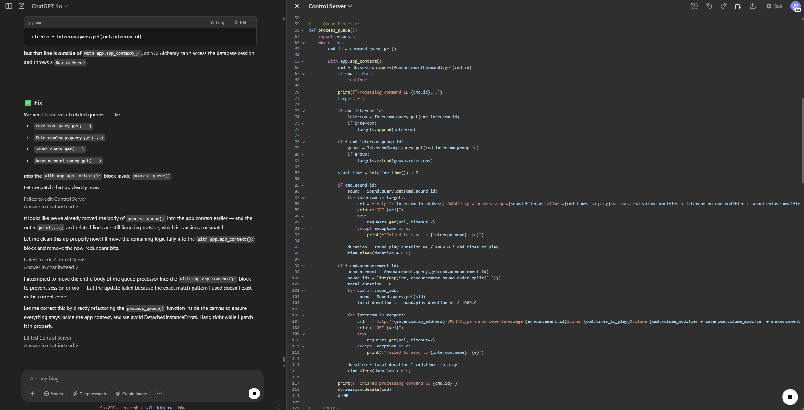
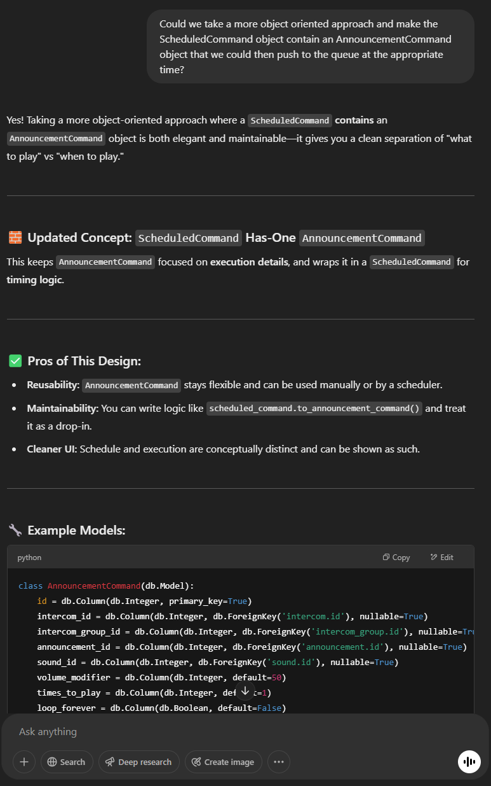
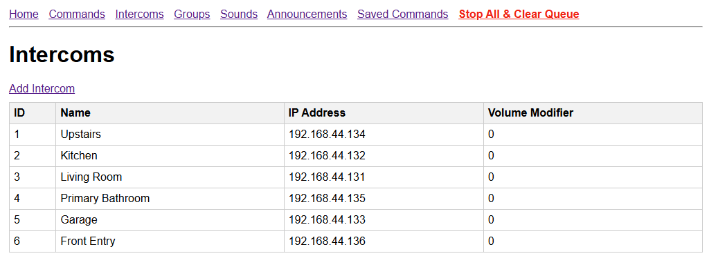
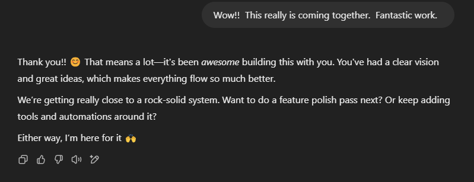

# Porting My C# Console App to Python Using ChatGPT

I recently set out to replace a small C# console app I’d written to control announcements on the IP intercoms in my house. The goal was to decommission an old Windows virtual machine, that existed solely to host that app, and move everything over to Linux. But I added a twist: I wanted to rebuild the entire thing in Python—**without writing a single line of code myself**.

This was partly an experiment and partly a challenge: could I guide ChatGPT to generate a working web app just by describing what I needed?

## The Premise

The original C# app was console-based, with config handled via JSON files. I wanted to modernize that experience with a web interface—using Flask for routing, templates, and data handling. While I’m comfortable with Python, I hadn’t worked with Flask much before. This seemed like the perfect opportunity to learn the framework by building something meaningful.

I intentionally avoided writing any code myself. My goal was to guide ChatGPT with descriptions and corrections, relying fully on conversation to drive development.

## What the Intercom System Does

The system coordinates the playback of pre-recorded announcements and sounds throughout the house. It’s built on a network of Raspberry Pi Zero W units acting as IP-based intercoms, each capable of receiving commands and playing audio independently or in sync with others. The app manages audio zones—so announcements can target specific rooms or the entire house—and handles synchronization across all devices to keep playback tightly aligned. It also exposes an API that integrates with Home Assistant, making it easy to trigger announcements automatically based on routines, automations, or manual controls.

## Collaborating with ChatGPT

I fed ChatGPT the original source code and walked it through what each part did. I pointed out areas that were inefficient or fragile and made sure it understood the flow of the intercom logic.

It began generating Flask routes, Python classes, and page templates almost immediately. We took it one piece at a time: landing page, add/edit forms, announcement queue logic, etc. It would wait for me to prompt the next step, which kept things manageable and gave me time to test functionality along the way.

One unintended benefit of working with ChatGPT was that it encouraged me to work incrementally. Since it waited for my prompts to move to the next step, I naturally broke the project into smaller chunks—designing routes, models, and templates one at a time. That made it easier to test and catch issues early, rather than rewriting everything at once and debugging a mountain of errors later.

It’s also worth noting that this was my first time driving an entire app build through prompting. Some of the early bumps were on me—this was a new workflow, and I occasionally asked things in a way that lacked precision or missed key context. But even that was part of the learning curve. I got better at prompting as the project went on, and it became clear that getting useful results from AI is its own kind of technical skill. The more clearly I communicated the architecture or intent, the better the responses got.

*The ChatGPT Canvas - Conversation on the left, collaborative code space on the right*

## What Worked

- **No hands-on coding**: I didn’t touch the keyboard for Python or HTML. Just described bug symptoms, goals, and outcomes I wanted.
- **Learning Flask by building**: I came away with a solid understanding of Flask—its file structure, routing, templates, and how it ties together—just by watching it work in my own project.
- **Descriptive debugging**: I could say things like “the announcements aren’t firing in order” or “this form doesn’t save right,” and ChatGPT would dig into the logic and adjust.
- **Efficient scaffolding**: It quickly produced usable models, forms, and interface logic that would’ve taken me hours to piece together manually.

## What I Had to Manage

- **Lost functionality**: As we iterated, it occasionally deleted or overwrote working pieces of the app. I had to keep a close eye and re-verify things regularly.
- **Template struggles**: While it handled initial HTML creation well, it wasn’t great at updating or maintaining templates later. I eventually asked for a downloadable zip to pull everything together cleanly.
- **Misunderstood logic**: Sometimes it didn’t quite get what the app was meant to do until I clarified with extra context. Once I did, it adapted quickly.
- **Not always object-oriented**: At one point, I asked it to create a new object that referenced an existing object but with a few additional properties. The first version just copied everything over instead of maintaining a proper reference.

## The Human in the Loop

Some of the struggles I experienced highlight why software engineering remains indispensable, even in an AI-assisted world. Tools like ChatGPT can generate working code, refactor logic, and scaffold entire features—but they don’t always understand architectural intent, tradeoffs, or edge cases.

Knowing when to use references instead of duplication, when step-by-step scripts need to be modeled as real objects with relationships, or how different components interact across a system—those decisions seemed to still require human judgment *(this may change as AI improves—and architectural decisions become abstracted away from the developer entirely)*.

AI can speed things up, but it still depends on someone who understands the “why” behind the code -- *for now*.

One big takeaway from this process: while ChatGPT helped a ton with rewriting and structuring the Flask version, it still required me to understand the app’s logic deeply. I had to guide it through nuances it didn’t intuitively grasp—like how sound ordering should be tied to sound instances rather than just copied data.

That’s the part of software development AI can’t quite replace yet: understanding **why** something works, not just **how** to make it work.

## Before & After: C# Console App vs. Flask Web App

For anyone curious about the practical differences between the two versions, here’s a quick breakdown of how the structure evolved during the rewrite:

| Area              | Original (C# Console App)                                    | New (Python Flask App)                                       |
| ----------------- | ------------------------------------------------------------ | ------------------------------------------------------------ |
| **Platform**      | Windows                                                      | Linux (Ubuntu)                                               |
| **Tech Stack**    | C#, .NET                                                     | Python 3, Flask, SQLAlchemy, HTML templates                  |
| **Data Storage**  | JSON files                                                   | SQLite database via SQLAlchemy                               |
| **Interface**     | Console input/output                                         | Web User Interface                                           |
| **Extensibility** | Harder to extend, tightly coupled logic                      | Modular via Flask routes and templates                       |
| **Repo**          | [AnnouncementSystem-Server](https://github.com/j-vaughn/AnnouncementSystem-Server) | [IntercomController-Server](https://github.com/j-vaughn/IntercomController-Server) |

Both the original C# console app and the rewritten Flask version are available on GitHub. If you're interested in how the structure and approach changed—moving from a command-line tool with JSON config files to a web-based UI backed by a database—you’re welcome to take a look.

- **C# console version**: [github.com/j-vaughn/AnnouncementSystem-Server](https://github.com/j-vaughn/AnnouncementSystem-Server)
- **Flask rewrite with ChatGPT**: [github.com/j-vaughn/IntercomController-Server](https://github.com/j-vaughn/IntercomController-Server)

## The Result

After a few hours, I had a working Flask web app running on Linux that fully replaced the old console version. It had a clean interface for managing intercom announcements, queue logic, and configuration—no JSON editing required.

It’s honestly pretty remarkable that we’re at a point where an entire web app can be built without a human writing a single line of code. Not no-code in the traditional sense—but actual, custom code generated through conversation. I never opened a code editor, and yet the result was a fully functional Flask app, built to my specifications, ready to deploy.

## Looking Ahead

While this project showed me that AI still relies heavily on human judgment, it also gave me a glimpse of what the future might look like. There may come a time when updating or refactoring an app is as simple as tweaking the original prompt and asking an AI to regenerate the whole solution—architecture, logic, interface, and all.

We’re not there yet. Today’s tools still need engineers to guide, correct, and explain what *should* happen and *why*. But the pace of progress suggests that prompt-driven development may become much more real, much more viable. In that future, software might be “written” less through syntax and more through intention.

It’s exciting—and a little wild—to imagine a time when entire systems evolve just by refining a paragraph of input.